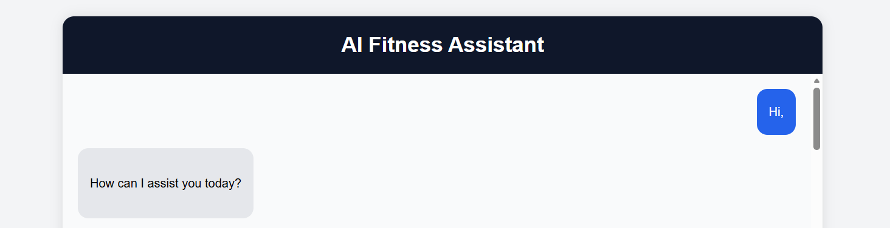
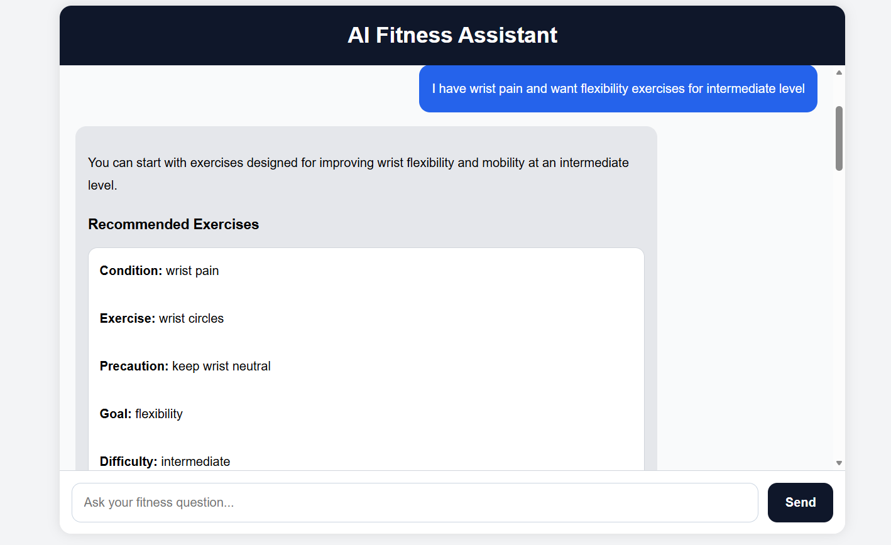
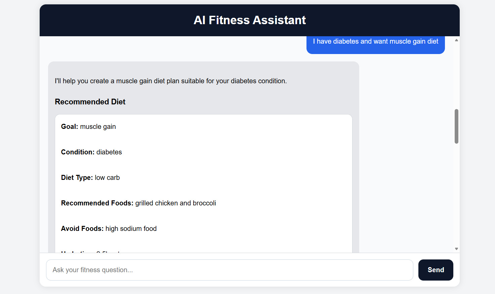

# AI Fitness Assistant

### Multi-RAG Recommendation System using FastAPI, FAISS and LLMs

AI Fitness Assistant is a GenAI-powered fitness recommendation system that combines Retrieval-Augmented Generation (RAG), metadata-aware retrieval, intent routing, and Large Language Models (LLMs) to provide grounded exercise and diet recommendations.

The system uses separate RAG pipelines for exercise and diet recommendations, ensuring responses remain accurate, relevant, and aligned with the user's condition, goals, and difficulty level.

---

## Features

### AI & RAG Features

* Query Classification & Intent Routing
* Multi-RAG Architecture
* Exercise Recommendation RAG Pipeline
* Diet Recommendation RAG Pipeline
* Metadata-Aware Retrieval
* Grounded Recommendation System
* Conversational Memory Support
* Safety Guidance Generation

### Retrieval Features

* FAISS Vector Search
* Sentence Transformer Embeddings
* Semantic Similarity Search
* CSV-Based Knowledge Base

### Backend Features

* FastAPI REST APIs
* Groq LLaMA 3.1 Integration
* Structured JSON Responses
* Swagger API Documentation

### Frontend Features

* Interactive Chat Interface
* Dynamic Recommendation Rendering
* Grounded Exercise Display
* Grounded Diet Display

---

## Architecture

User Query
↓
Query Classifier
↓
Metadata Extraction
↓
Intent Routing
↓
Exercise RAG / Diet RAG
↓
Metadata Filtering
↓
FAISS Retrieval
↓
Prompt Construction
↓
Groq LLaMA 3.1
↓
Structured JSON Response
↓
Frontend Rendering

### Intent Routing

The system supports four query types:

* General Conversation
* Exercise Recommendation
* Diet Recommendation
* Exercise + Diet Recommendation

Each query is routed to the appropriate retrieval pipeline before response generation.

---

## Tech Stack

### Backend

* Python
* FastAPI
* Pydantic
* Uvicorn

### AI / ML

* Groq API
* LLaMA 3.1
* Sentence Transformers
* FAISS

### Data Processing

* Pandas
* NumPy

### Frontend

* HTML
* CSS
* JavaScript

---

## Project Structure

ai-fitness-chatbot/

├── app/
│   ├── main.py
│   ├── rag.py
│   ├── diet_rag.py
│   ├── query_classifier.py
│   ├── prompts.py
│   └── models.py
│
├── data/
│   ├── cleaned_fitness_data.csv
│   └── cleaned_diet_data.csv
│
├── frontend/
│   └── index.html
│
├── requirements.txt
├── .env.example
├── README.md

---

## Setup Instructions

### Clone Repository

git clone <repository-url>

cd ai-fitness-chatbot

### Install Dependencies

pip install -r requirements.txt

### Configure Environment Variables

Create a `.env` file:

GROQ_API_KEY=your_groq_api_key

### Run Backend

uvicorn app.main:app --reload

### Access Swagger UI

http://127.0.0.1:8000/docs

---

## Example Queries

### Exercise Query

I have wrist pain and want flexibility exercises for intermediate level.

### Diet Query

I have diabetes and want muscle gain diet.

### Combined Query

I have lower back pain and want fat loss. Suggest exercise and diet.

### General Query

Hi, I want to know more about fitness.

---

## Application Screenshots

### General Chat

### Exercise Recommendation

### Diet Recommendation

---

## API Response Format

{
"assistant_response": "...",
"safety_guidance": "..."
}

---

## Future Improvements

* User Authentication
* Personalized User Profiles
* Workout Tracking
* Cloud Deployment
* Analytics Dashboard
* Recommendation Feedback Loop

---

## Author

**Vijay Kiran Chowdary Gandhamaneni**

AI Intern | GenAI | FastAPI | RAG Systems | Conversational AI
